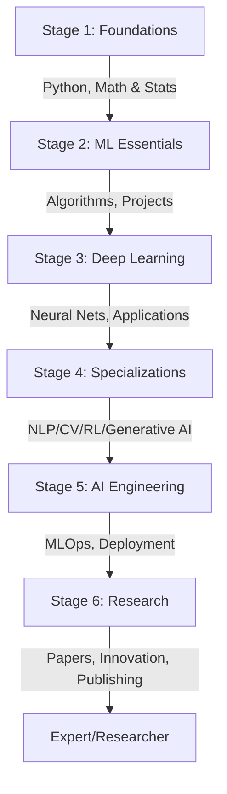

# AI Learning Roadmap: Becoming an AI Engineer and Researcher

---

## 📋 Table of Contents
1. [Overview](#-overview)
2. [Stage 1: Foundations](#-stage-1-foundations)
3. [Stage 2: Machine Learning Essentials](#-stage-2-machine-learning-essentials)
4. [Stage 3: Deep Learning & AI Applications](#-stage-3-deep-learning--ai-applications)
5. [Stage 4: Advanced Topics & Specializations](#-stage-4-advanced-topics--specializations)
6. [Stage 5: AI Engineering & MLOps](#-stage-5-ai-engineering--mlops)
7. [Stage 6: Research & Innovation](#-stage-6-research--innovation)
8. [YouTube Channels](#-youtube-channels-21-total)
9. [Substack Newsletters](#-substack-newsletters-17-total)
10. [Putting It All Together](#-putting-it-all-together)
11. [Pro Tips & Resources](#-pro-tips--resources)

---

## 📖 Overview

- **Duration**: 6 months total (12-18 hrs/week)
- **Target Roles**: AI Engineer, ML Engineer, Research Scientist
- **2026 Trends**: Efficient LLMs, Multimodal AI, Ethical MLOps, XAI
- **Track Progress**: GitHub portfolio with 5-10 projects

---

## 🎯 Stage 1: Foundations
**Focus**: Programming + Math (1 month)  
**Why**: Core for pipelines (Engineers) & algorithm derivation (Researchers)

### 1.1 Python & Programming

| Resource Type | Resource | Link | Description |
| :--- | :--- | :--- | :--- |
| YouTube | Corey Schafer | [Link](#) | Syntax, decorators |
| YouTube | Sentdex | [Link](#) | Projects (scraping) |
| YouTube | freeCodeCamp Python | [Link](#) | 4hr full course |
| YouTube | CampusX 100 Days | [Link](#) | Daily challenges |
| YouTube | Vizuara | [Link](#) | Scratch builds |
| YouTube | CS50 Python | [Link](#) | Harvard lectures |
| YouTube | Automate Boring Stuff | [Link](#) | Practical scripts |
| Courses | Codecademy Python | [Link](#) | Interactive |
| Courses | DataCamp Python | [Link](#) | Hands-on |
| Courses | Kaggle Python | [Link](#) | Jupyter-based |
| Blogs | Real Python | [Link](#) | Advanced topics |
| Blogs | Towards DS (Basics) | [Link](#) | Data science |
| Books | Python Crash Course | [Link](#) | Project-based |
| Books | Automate Boring Stuff | [Link](#) | FREE online |

**Projects**: Todo app, web scraper, Iris dataset analysis

### 1.2 Math & Statistics

| Resource Type | Resource | Link | Description |
| :--- | :--- | :--- | :--- |
| YouTube | 3Blue1Brown Linear Algebra | [Link](#) | Visual intuition |
| YouTube | 3Blue1Brown Calculus | [Link](#) | Visual intuition |
| YouTube | Khan Academy | [Link](#) | Full courses |
| YouTube | CampusX Linear Algebra | [Link](#) | AI-focused |
| YouTube | StatQuest Stats | [Link](#) | p-values, regression |
| YouTube | MIT OCW Linear Algebra | [Link](#) | Proofs |
| Courses | Math for ML (Coursera) | [Link](#) | PCA, calc |
| Courses | edX Probability (MIT) | [Link](#) | Bayesian |
| Blogs | Analytics Vidhya | [Link](#) | Gradient descent |
| Blogs | Distill.pub | [Link](#) | Interactive math |
| Books | Math for ML | [Link](#) | FREE PDF |
| Books | Intro to Probability | [Link](#) | Stats + code |

**Practice**: Brilliant.org, LeetCode math, matrix multiplication from scratch  
**Milestone**: Iris dataset analysis (GitHub notebook)

---

## 🎯 Stage 2: Machine Learning Essentials
**Focus**: Algorithms + Projects (1 month)

| Resource Type | Resource | Link | Description |
| :--- | :--- | :--- | :--- |
| YouTube | Simplilearn AI/ML | [Link](#) | Overviews |
| YouTube | StatQuest | [Link](#) | Trees, SVMs |
| YouTube | Krish Naik ML | [Link](#) | Code guides |
| YouTube | CampusX 100 Days ML | [Link](#) | Implementations |
| YouTube | Andrew Ng ML | [Link](#) | Classic |
| Courses | Andrew Ng ML (Coursera) | [Link](#) | Assignments |
| Courses | IBM AI Engineering | [Link](#) | Scikit-learn |
| Courses | DataCamp ML Track | [Link](#) | Validation |
| Books | Hands-On ML (Géron) | [Link](#) | Code guide |
| Books | Statistical Learning | [Link](#) | FREE PDF |

**Projects**:
- House prices (regression)
- Spam classification
- Customer churn (ensembles)

**Platforms**: Kaggle, fast.ai  
**Milestone**: Deploy to Streamlit

---

## 🎯 Stage 3: Deep Learning & AI Applications
**Focus**: Neural Networks (1 month)

| Resource Type | Resource | Link | Description |
| :--- | :--- | :--- | :--- |
| YouTube | Sentdex DL | [Link](#) | Keras/PyTorch |
| YouTube | DeepLizard Keras | [Link](#) | Embeddings |
| YouTube | freeCodeCamp DL | [Link](#) | 10hr crash course |
| YouTube | 3Blue1Brown NN | [Link](#) | Backprop |
| YouTube | fast.ai DL | [Link](#) | Code-first |
| Courses | Deep Learning Spec | [Link](#) | CNNs, seq models |
| Books | Dive into DL | [Link](#) | FREE interactive |
| Books | Deep Learning | [Link](#) | FREE theory |

**Projects**: 
- MNIST/CIFAR-10 CNN
- LSTM chatbot
- BERT sentiment (Hugging Face)

**Frameworks**: TensorFlow, PyTorch  
**Milestone**: Fine-tune BERT on custom data

---

## 🎯 Stage 4: Advanced Topics & Specializations
**Focus**: Pick 1-2 areas (1 month)

| Area | Resource | Link | Description |
| :--- | :--- | :--- | :--- |
| NLP | Yannic Kilcher | [Link](#) | Paper reviews |
| CV | Udacity CV Nanodegree | [Link](#) | Object detection |
| RL | AssemblyAI NLP | [Link](#) | Tutorials |
| GenAI | Andrej Karpathy GPT | [Link](#) | Build from scratch |
| All | NLP Specialization | [Link](#) | Transformers |
| All | Generative AI LLMs | [Link](#) | 2025 top course |

**Projects**: Gymnasium RL agent, Diffusion image generation  
**Papers**: [Papers with Code](https://paperswithcode.com/)  
**Milestone**: Reproduce 1 paper

---

## 🎯 Stage 5: AI Engineering & MLOps
**Focus**: Production systems (1 month)

| Skill | Resource | Link | Description |
| :--- | :--- | :--- | :--- |
| MLOps | AssemblyAI MLOps | [Link](#) | YouTube series |
| Cert | Google ML Engineer | [Link](#) | Cloud cert |
| Course | MLOps Specialization | [Link](#) | Full pipeline |
| Book | Designing ML Systems | [Link](#) | Production guide |
| Tools | MLOps.community | [Link](#) | Slack community |

**Projects**: FastAPI/Docker deploy, Kubeflow pipeline  
**Milestone**: Cloud-deployed churn model (AWS/GCP)

---

## 🎯 Stage 6: Research & Innovation
**Focus**: Original work + Publishing (1 month)

| Category | Resource | Link | Description |
| :--- | :--- | :--- | :--- |
| Guide | 0 to Research Scientist | [Link](#) | Rated resources |
| Skills | How to Read Papers | [Link](#) | 10min algorithm |
| Compute | NAIRR Pilot | [Link](#) | FREE GPUs |
| Books | Elements of Stat Learning | [Link](#) | FREE advanced |
| Papers | Papers with Code | [Link](#) | Benchmarks + code |
| Papers | Connected Papers | [Link](#) | Citation graphs |
| Community | r/MachineLearning | [Link](#) | 3M+ members |

### Expanded Research Projects (Pick 3-5)

| # | Project | Key Paper | Tools | Time | Output | Resources |
| :--- | :--- | :--- | :--- | :--- | :--- | :--- |
| 1 | Transformer Variant | Attention | PyTorch, HF | 4-6w | EMNLP submission | Yannic, HF Course |
| 2 | XAI Healthcare | SHAP | TF, SHAP | 6-8w | Streamlit dashboard | Two Minute Papers, Inspirit |
| 3 | Efficient Diffusion | DDPM | PyTorch | 5-7w | HF Spaces demo | Karpathy, ProjectPro |
| 4 | RL Climate | PPO | Gymnasium | 6-8w | arXiv preprint | Raschka, Immerse |
| 5 | Federated Learning | FedAvg | Flower | 7-10w | Open-source PR | AI Engineer, Reddit |

- **Conferences**: NeurIPS 2025 (Dec 2-7), ICML 2025 (Jul 13-19)
- **Milestone**: arXiv preprint or workshop paper

---

## 📺 YouTube Channels (21 Total)

| # | Channel | Focus | Link |
| :--- | :--- | :--- | :--- |
| 1 | 3Blue1Brown | Math/LLMs | [Link](#) |
| 2 | CampusX | ML/DS | [Link](#) |
| 3 | Krish Naik | Agentic AI | [Link](#) |
| 4 | Dave Ebbelaar | Idea→App | [Link](#) |
| 5 | 3Blue1Brown Hindi | Math (Hindi) | [Link](#) |
| 6 | Vizuara | From Scratch | [Link](#) |
| 7 | Matthew Berman | News/Reviews | [Link](#) |
| 8 | Siraj Raval | Fun Projects | [Link](#) |
| 9 | AAmini | MIT DL | [Link](#) |
| 10 | David Ondrej | AI→Startup | [Link](#) |
| 11 | Umar Jamil | Tools | [Link](#) |
| 12 | Stanford Online | CS224N | [Link](#) |
| 13 | Google DeepMind | Research | [Link](#) |
| 14 | Andrej Karpathy | GPT Builds | [Link](#) |
| 15 | StatQuest | ML Breakdowns | [Link](#) |
| 16 | Sebastian Raschka | LLMs | [Link](#) |
| 17 | AI Engineer | Production | [Link](#) |
| 18 | Welch Labs | Easy Explainers | [Link](#) |
| 19 | Yannic Kilcher | Paper Deep-dives | [Link](#) |
| 20 | Two Minute Papers | SOTA Summaries | [Link](#) |
| 21 | fast.ai | Practical DL | [Link](#) |

---

## 📧 Substack Newsletters (17 Total)

| Newsletter | Focus | Link |
| :--- | :--- | :--- |
| Paul Iusztin | AI Insights | [Link](#) |
| Grant Sanderson | Math/AI | [Link](#) |
| AlphaSignal AI | Trends | [Link](#) |
| Vizuara AI Labs | Builds | [Link](#) |
| Jay Alammar | Visual Explainers | [Link](#) |
| Elvis | AI News | [Link](#) |
| Ahead of AI | Future Tech | [Link](#) |
| Decoding ML | ML Deep-dives | [Link](#) |
| DiamantAI | Engineering | [Link](#) |
| Machine Learning Pills | Tutorials | [Link](#) |
| BeansANDBytes | Data Science | [Link](#) |
| TechTalks | Industry | [Link](#) |
| NLP Newsletter | NLP Focus | [Link](#) |
| SwirlAI | Engineering Tips | [Link](#) |
| Import AI | Research Roundup | [Link](#) |
| The Batch | DeepLearning.AI | [Link](#) |

---

## 🚀 Putting It All Together

| Stage | Action Items | Duration | Milestone |
| :--- | :--- | :--- | :--- |
| 1 | Python + Math courses | 1 mo | Iris analysis |
| 2 | ML algorithms + Kaggle | 1 mo | Streamlit deploy |
| 3 | Neural nets + HF | 1 mo | Fine-tune BERT |
| 4 | Specialize (NLP/CV) | 1 mo | Paper reproduction |
| 5 | MLOps cert + deploy | 1 mo | Cloud pipeline |
| 6 | 3-5 research projects | 1 mo | arXiv preprint |

---

## 💡 Pro Tips & Resources

| Category | Details | Links |
| :--- | :--- | :--- |
| Portfolio | 5-10 GitHub projects with READMEs | [GitHub](https://github.com/) |
| Certifications | Google ML Engineer, AWS ML | [Google](#), [AWS](#) |
| Communities | Reddit, DataCamp, LinkedIn | [r/learnmachinelearning](https://www.reddit.com/r/learnmachinelearning/), [DataCamp](#) |
| Stay Updated | arXiv daily, DataFramed podcast | [arXiv](https://arxiv.org/), [Podcast](#) |
| Job Hunt | ATS resumes, FAANG/Startups | [LinkedIn](https://www.linkedin.com/) |

---

### 🤝 Community
Follow me if this is helpful for you!  
Please write a recommendation for me: [@AhsanUmar](https://www.linkedin.com/in/ahsanumar/) on LinkedIn

---

🎉 **Happy Learning! From Zero to AI Expert in 2026**  
*Document created: January 2, 2026 | Total Resources: 100+ | Verified Links*
